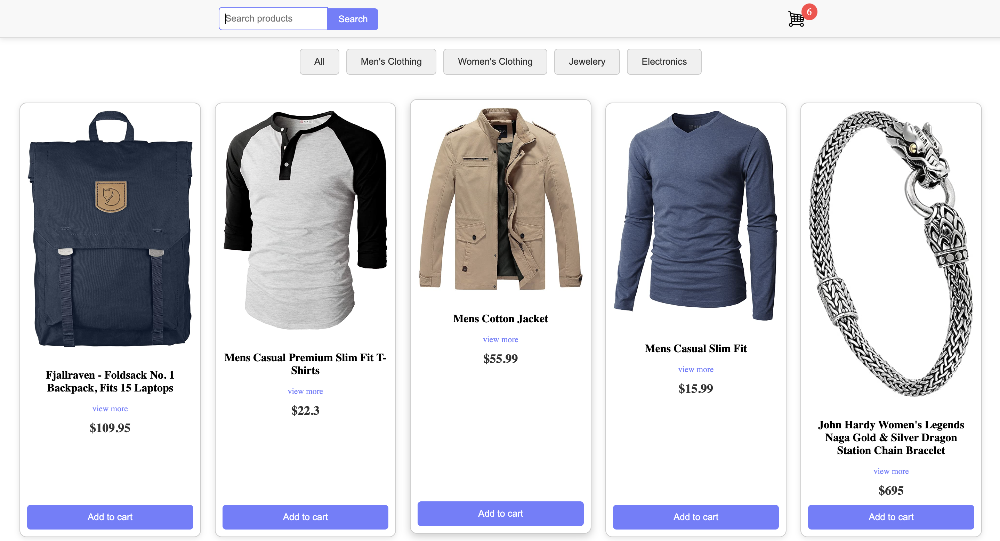

# 🛍️ E-Commerce Store

A simple e-commerce store built with **React**, fetching product data from [FakeStore API](https://fakestoreapi.com/) to display items dynamically. Users can browse products by category, search for items, and add them to a cart.

## 🚀 Features

✅ Fetches product data from an external API  
✅ Category-based filtering (Men’s Clothing, Women’s Clothing, Jewelry, Electronics)  
✅ Live search functionality  
✅ Add to cart feature  
✅ Responsive design  

## 🖼️ Screenshots

## 🛠️ Tech Stack

- **Frontend**: React.js, CSS  
- **API**: [FakeStore API](https://fakestoreapi.com/)  
- **State Management**: useState, useEffect  

## 📂 Folder Structure

